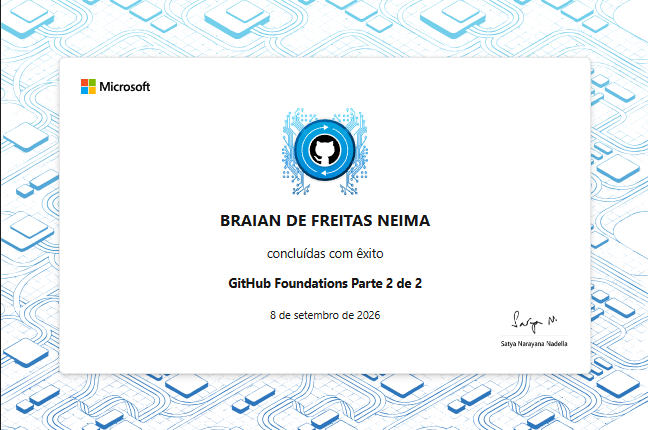
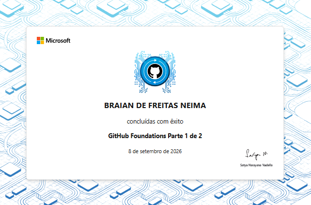

# Olá, eu sou o Braian de Freitas Neima 👋

🎓 Estudante de Ciência da Computação | 💻 Desenvolvedor em formação

## 🚀 Sobre mim

Estou em constante aprendizado sobre desenvolvimento de software e boas 
práticas de versionamento de código.

## 🛠️ Tecnologias e ferramentas

## 🏆 Certificações

- ✅ **GitHub Foundations** — Microsoft Learn (trilha completa, Parte 1 e 2)

## 📌 Projetos em destaque

Confira os repositórios fixados abaixo 👇

## 📫 Contato

- [LinkedIn](https://www.linkedin.com/in/braiandev/)
- [Portfólio](https://ysedev.github.io/portfolio/)
